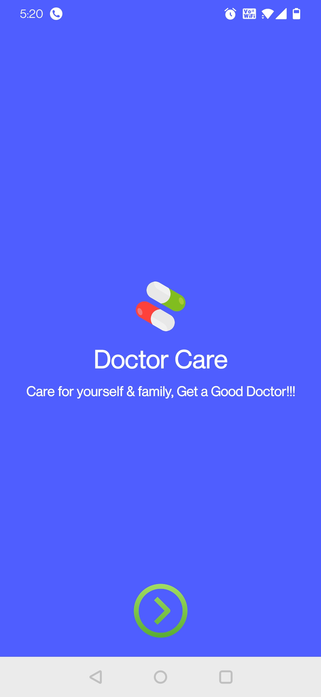
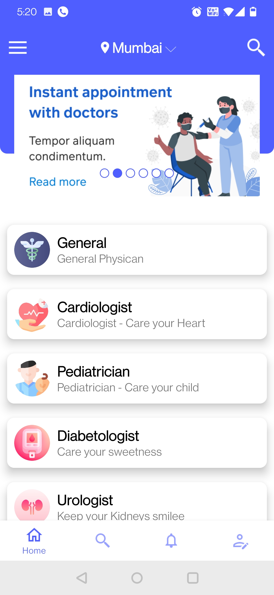
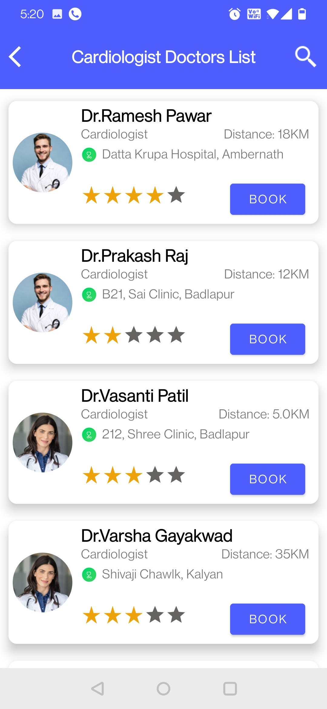
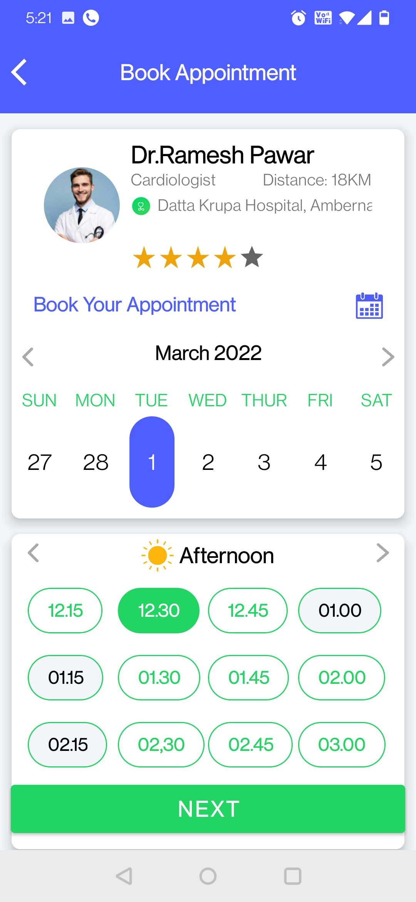
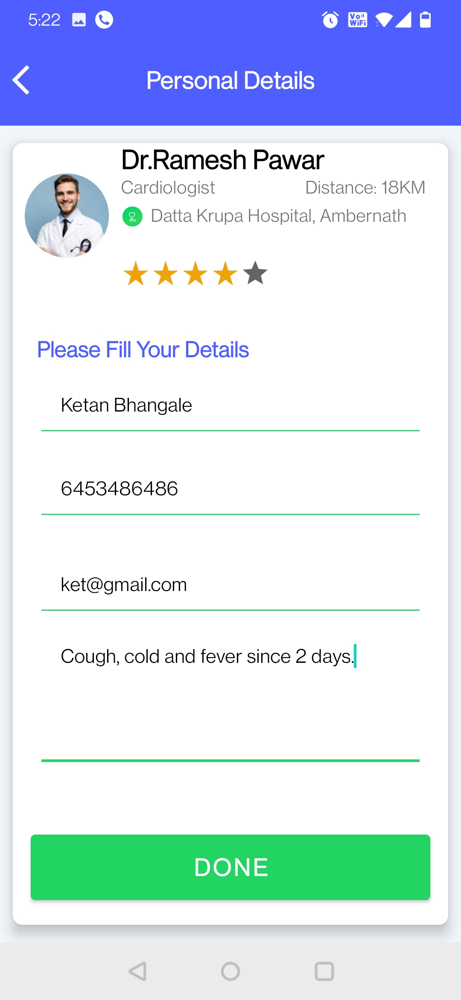
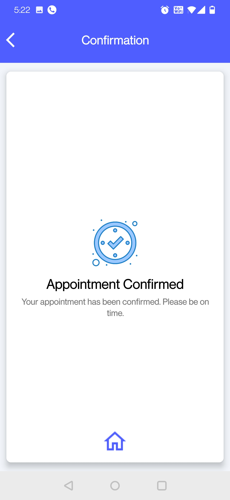
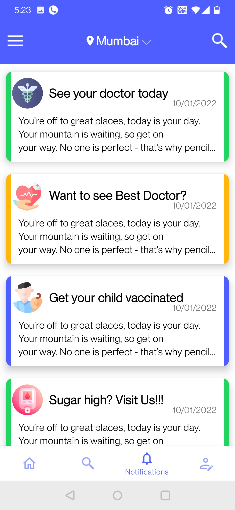
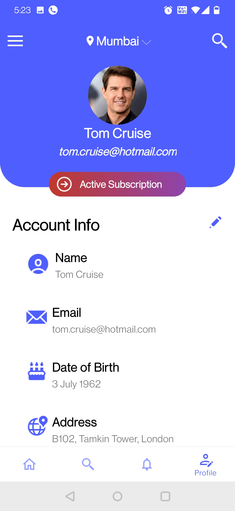
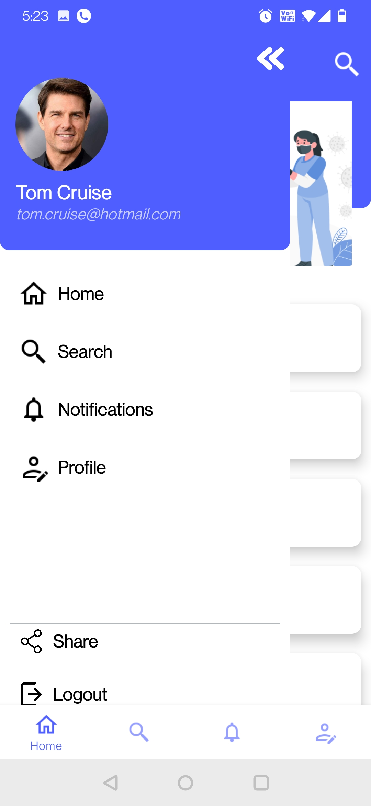

# Doctor-Care-App-Demo - MVVM Architecture

A complete app having following feature:
1. List of all types of doctors near by your location.
2. Search all doctors
3. Select Doctor and book appointment.
4. Profile
5. Notification

The app is demo app and it use firebase firestore as cloud storage. All the data is dummy data fetched from firestore.

Technologies Used:

1. MVVM
2. Fragments 
3. Firebase 
4. Google 
5. Recyclerview
6. Dependency-Injection
7. Kotlin-android
8. Gson
9. Viewpager
10. Repository-pattern
11. Adapter-pattern
12. Kotlin-coroutines
13. Firebasestorage
14. Navigation-architecture-component
15. Jetpack-android
16. Livedata-viewmodel
17. Dagger-hilt
18. Viewbinding-android

Apps Screenshots:

     &nbsp;&nbsp;&nbsp;  
    

     

     &nbsp;&nbsp;&nbsp;  
    

     

     &nbsp;&nbsp;&nbsp;  
    

     

     &nbsp;&nbsp;&nbsp;  
    

     

     
    

     

